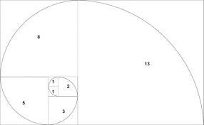

# Gerando a e-nésima sequência de Fibonacci em Rust!

Essa é a atividade do livro [A Linguagem de Programação Rust](https://rust-br.github.io/rust-book-pt-br/title-page.html) no capítulo 3 página 5. Ali o texto pede para que nós criemos um programa em Rust que gere a e-nésima sequência de Fibonacci. Mas afinal, o que é a "sequência de fibonacci"?.

## Entendendo Fibonacci

Foi uma sequência de números descoberta pelo então matemático [Leonardo de Pisa](https://www.infoescola.com/biografias/leonardo-	fibonacci/), mais conhecido como Fibonacci. Em 1200 Fibonacci aparece criando a tal famosa sequência, ele, observou na beleza da natureza que havia uma "divina proporção" em várias plantas, como por exemplo, a espiral da folha de bromélia. A espiral observada por Fibonacci cresce na mesma medida que o retângulo de ouro, obedecendo a proporção de 1,618.

A sequência diz:

```
	Fn = Fn-1 + Fn-2, where n > 1
	
	//sendo assim:
	
	0, 1, 1, 2, 3, 5...∞
```


Ao observar, percebeu que suas áreas retangulares aumentavam de acordo com a sequência proposta por ele. Todos eles possuem medidas exatas de acordo com a divina proporção.



A natureza não é fascinante?


## Entendendo o código